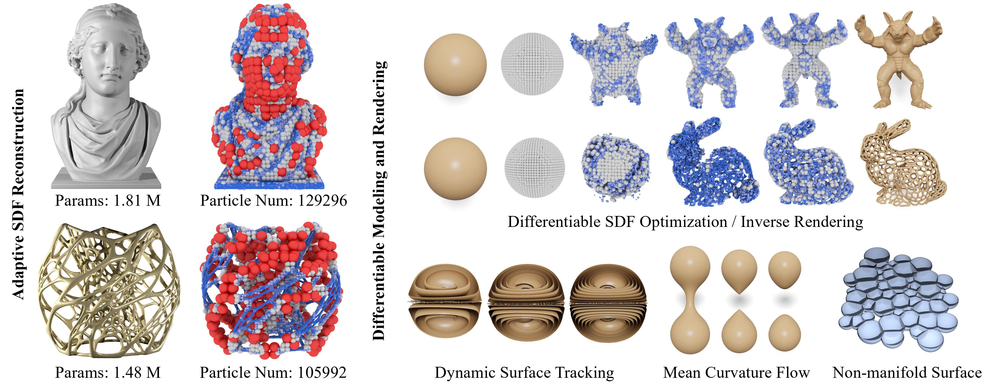
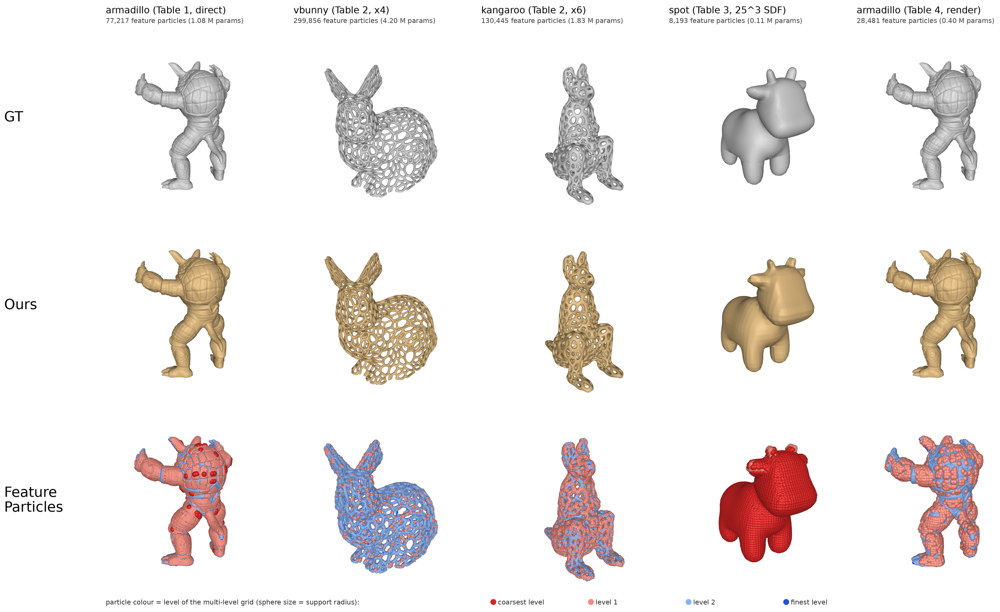
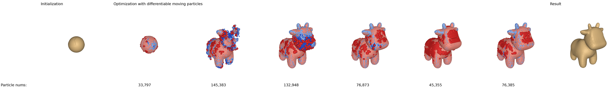

<div align="center">

<h1 align="center">Multi-level Partition of Unity on Differentiable Moving Particles</h1>

<p align="center">
  <a href="https://jinjinhe2001.github.io/"><strong>Jinjin He</strong></a><sup>1</sup> &middot;
  <a href="https://orcid.org/0000-0002-7395-5372"><strong>Taiyuan Zhang</strong></a><sup>1</sup> &middot;
  <a href="https://orcid.org/0000-0003-3597-1328"><strong>Hiroki Kobayashi</strong></a><sup>3</sup> &middot;
  <a href="https://orcid.org/0000-0002-9335-1269"><strong>Atsushi Kawamoto</strong></a><sup>3</sup> &middot;
  <a href="https://orcid.org/0000-0002-1812-068X"><strong>Yuqing Zhou</strong></a><sup>4</sup> &middot;
  <a href="https://orcid.org/0000-0002-7055-6675"><strong>Tsuyoshi Nomura</strong></a><sup>3</sup> &middot;
  <a href="https://faculty.cc.gatech.edu/~bozhu/"><strong>Bo Zhu</strong></a><sup>2</sup>
</p>

<p align="center">
  <sup>1</sup>Dartmouth College &nbsp;&nbsp; <sup>2</sup>Georgia Institute of Technology &nbsp;&nbsp;
  <sup>3</sup>Toyota Central R&amp;D Labs., Inc. &nbsp;&nbsp; <sup>4</sup>Toyota Research Institute of North America
</p>

<p align="center"><em>ACM Transactions on Graphics 43(6), SIGGRAPH Asia 2024</em></p>

<p align="center">
  <a href="https://jinjinhe2001.github.io/diffmpu-page/assets/paper/SASIA_2024__Particle_PU%20(5).pdf"><strong>Paper</strong></a> &nbsp;|&nbsp;
  <a href="https://dl.acm.org/doi/10.1145/3687989"><strong>ACM DL</strong></a> &nbsp;|&nbsp;
  <a href="https://jinjinhe2001.github.io/diffmpu-page/index.html"><strong>Project Page</strong></a> &nbsp;|&nbsp;
  <a href="https://www.youtube.com/watch?v=idHAYIO04AY"><strong>Video</strong></a> &nbsp;|&nbsp;
  <a href="#citation"><strong>BibTeX</strong></a>
</p>

<p align="center">
  
</p>

</div>

We introduce a differentiable moving particle representation based on the multi-level partition of unity (MPU) to
represent dynamic implicit geometries. Two groups of particles, feature particles and sample particles, move in space
and produce dynamic surfaces according to external velocity fields or optimization gradients, guiding and correcting
each other by alternating their roles as inputs and outputs. Each feature particle carries the coefficients of a local
quadratic patch; the patches are blended with partition-of-unity weights over a multi-level background grid into a
continuous implicit surface. Sample particles carry positions and orientations and serve as dense surface samples for
optimization. The representation needs less memory and fewer iterations than neural implicit representations and is
considerably more accurate on topologically complex shapes and in dynamic tracking.

This repository contains the Taichi / PyTorch implementation used for the paper: surface reconstruction from oriented
points, differentiable flows against Chamfer, SDF-grid and inverse-rendering losses, and surface tracking under
velocity fields.

<p align="center">
  
  <br>
  <em>Ground truth, our surface, and the feature particles coloured by grid level.</em>
</p>

## Installation

Tested with Python 3.10, CUDA 12.1 and an NVIDIA H100; the reconstruction and Chamfer / SDF experiments also run on a
16 GB consumer GPU.

```
conda create -n mpu python=3.10 && conda activate mpu
pip install -r requirements.txt
# optional: pytorch3d (faster k-NN and marching cubes for the differentiable tasks)
pip install --no-index pytorch3d -f https://dl.fbaipublicfiles.com/pytorch3d/packaging/wheels/py310_cu121_pyt251/download.html
# inverse rendering only
pip install "git+https://github.com/NVlabs/nvdiffrast.git@v0.4.0"
python scripts/smoke_test.py      # quick check, no data needed
```

`scripts/setup_env.sh` does the same on Linux. On Windows with an RTX 50 series card use the CUDA 12.8 torch wheels and
`libigl>=2.6`; `pip install msvc-runtime` provides the Visual C++ DLLs if they are missing.

Meshes are not included. `data/README.md` lists the files the recipes expect under `data/` and where to get them. Open
Stanford scans are closed with `python scripts/data/make_watertight.py in.ply data/bunny.ply`.

## Usage

```
# reconstruct a mesh (Table 1 setting)
python scripts/run_recon.py --mesh data/Armadillo.ply --out runs/armadillo --curv_mode pca \
    --set base_res=64 num_levels=4 thresholds=[0,21.25,42.5,85] aux_shells=[0.25,0.5,0.75] n_proj=2 max_fp=1048576

# differentiable tasks: --task chamfer | sdfgrid | render
python scripts/run_diff.py --task chamfer --mesh data/spot.obj --out runs/spot_chamfer --iters 2500

# surface tracking (deformation / rotation)
python scripts/run_deform.py --test deform --steps 500 --reverse_at 250 --out runs/deform
```

Outputs go to the `--out` directory (`recon.ply` / `final.ply`, `result.json` with the metrics, `config.json`). All
meshes are normalised to the unit cube; `result.json["normalize"]` holds the transform back. `--help` lists the
flags, `docs/USAGE.md` describes the scripts, the `--set` configuration keys and the Python API:

```python
import mpu
mpu.init(ti_mem_gb=4)
pos, nrm, cur, meta = mpu.particles_from_mesh("data/Armadillo.ply", n=3_000_000)
R = mpu.build_mpu(pos, nrm, cur, cfg=mpu.recon_config(fine_res=512, num_levels=4), surface_area=meta["surface_area"])
f, g = R.eval(pts, return_grad=True)      # signed field (negative inside) and gradient at pts in [-1, 1]^3
V, F = R.marching_cubes(512)
```

## Experiments

`recipes/` holds the command of every experiment, one jsonl file per table of the paper:

```
python scripts/launch.py recipes/table2_chamfer.jsonl --gpus 0,1,2,3     # --only spot runs a single line
python scripts/summarize.py 'table2/*'
```

Table 4 (inverse rendering) has a second stage, `recipes/table4_final_flow.jsonl`, which continues a finished run from
its saved particles with `tools/resume_eval.py`. The Table 4 recipes are written for an 80 GB GPU; on smaller cards add
`--view_chunk 25 --ti_mem 8`. Poisson resampling draws its random seed from the clock, so repeated runs of the
Chamfer and SDF-grid experiments differ by about 0.001 IoU.

<p align="center">
  
</p>

## Citation

```bibtex
@article{2024diffmpu,
 title={Multi-level Partition of Unity on Differentiable Moving Particles},
 author={Jinjin He and Taiyuan Zhang and Hiroki Kobayashi and Atsushi Kawamoto and Yuqing Zhou and Tsuyoshi Nomura and Bo Zhu},
 journal={ACM Trans. Graph.},
 volume={43},
 number={6},
 article={273},
 year={2024},
}
```

## License

MIT. `mpu/dpsr.py` and `mpu/sap.py` port the differentiable Poisson solver of Shape As Points (Peng et al. 2021),
`mpu/render_utils.py` adapts the renderer of Neural Implicit Evolution (Mehta et al. 2022), and the Large-Steps
preconditioner follows Nicolet et al. 2021; see `THIRD_PARTY_NOTICES.md`. The inverse-rendering task depends on
nvdiffrast (NVIDIA Source Code License, research use only).
